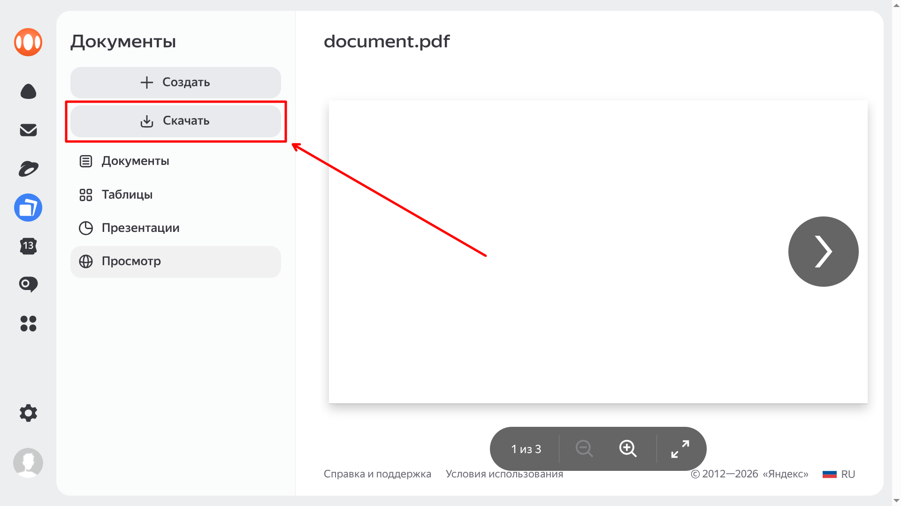

# Yandex Disk PDF Scraper
Юзерскрипт для скачивания PDF из Яндекс Диска, на которых стоит защита от скачивания.

Мотивация:
- Просмотрщик PDF в Яндексе неудобный (по страницам и частые капчи).
- Я хочу сохранять документы на свой компьютер и просматривать их офлайн.

## Установка

Установите юзерскрипт в ваш менеджер юзерскриптов:
https://github.com/wadrodrog/yandex-disk-pdf-scraper-userscript/raw/refs/heads/main/yandex-disk-pdf-scraper.user.js

- Для Firefox лучше использовать [Greasemonkey](https://addons.mozilla.org/firefox/addon/greasemonkey) или [Violentmonkey](https://addons.mozilla.org/firefox/addon/violentmonkey).
- Для Chromium лучше использовать [Tampermonkey](https://chromewebstore.google.com/detail/tampermonkey/dhdgffkkebhmkfjojejmpbldmpobfkfo).
    - В Chromium надо разрешить расширению Tampermonkey пользовательские скрипты и включить режим разработчика, чтобы юзерскрипт заработал.
    - Tampermonkey почему-то медленно формирует документ.
- На Safari пока не было протестировано, но там есть расширение [Userscripts](https://apps.apple.com/app/userscripts/id1463298887).
- Мобильные версии браузеров не тестировались.

## Использование

Юзерскрипт добавляет кнопку скачивания на боковую панель под кнопку "Создать".
Она открывает новую вкладку, в которой скачивает все страницы и формирует PDF.
По завершении процесса PDF сохраняется на компьютер.

Если кнопки скачивания нет, или скачивание не началось спустя несколько секунд, то перезагрузите страницу.
Если всё равно не работает, то либо скрипт не установился должным образом, либо обновление на стороне яндекса что-то сломало.

Иногда юзерскрипт может открывать новые вкладки, что может блокироваться браузером.
Нужно разрешить всплывающие окна, если такое предложение появится в адресной строке.

В процессе скачивания Яндекс может закидывать вас капчами.
Если из-за этого скачивание не удаётся, то юзерскрипт показывает предупреждение.

## Ограничения

- Страницы в PDF сохраняются как изображения. Как следствие, текст нельзя выделять и копировать. То же самое происходит и при просмотре в браузере - это ограничение со стороны Яндекса.
- Скачивание нескольких файлов одновременно может вызывать проблемы.
- При появлении капчи нужно начинать скачивание заново. Возможно в будущем будет реализован механизм, позволяющий пройти капчу и возобновить скачивание.

## Лицензия и благодарности

Скрипт опубликован по лицензии [Unlicense](https://unlicense.org).
Если вы нашли этот скрипт полезным и используете его где-либо ещё, просим указать ссылку на оригинальный репозиторий.

Для генерации PDF используется библиотека [jsPDF](https://github.com/parallax/jsPDF), лицензия MIT.

Похожий проект: https://colab.research.google.com/drive/1GY43-A2uFMahE9-zMH2-mFjPcq5w-mDa
